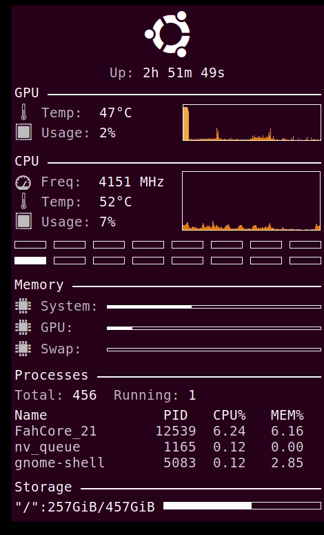

This is a conky script that will display useful information about the GPU, CPU, memory, running processes and total storage.

## Required packages (see installation)
1. conky
2. conky-colors

## Installation
1. install conky on the system
2. install conky-colors (https://github.com/helmuthdu/conky_colors)
3. add the .sh script as a start-up program
4. place the conkyrc file into /home/.conkycolors/
5. reboot

The monitoring panel will show up a few seconds after logging in.

## Script in action

